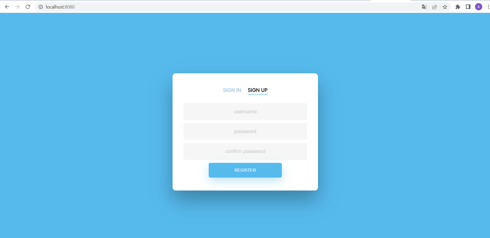
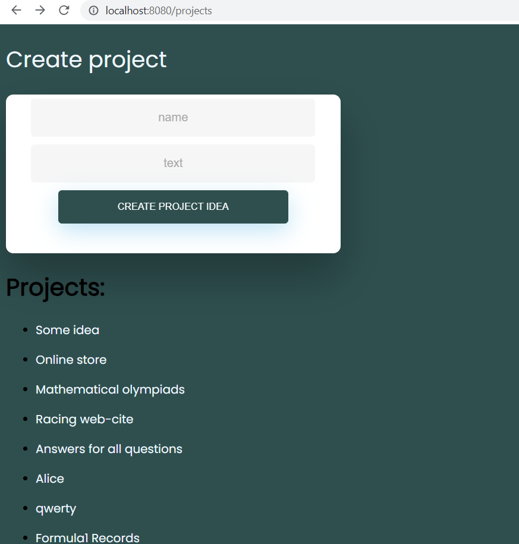
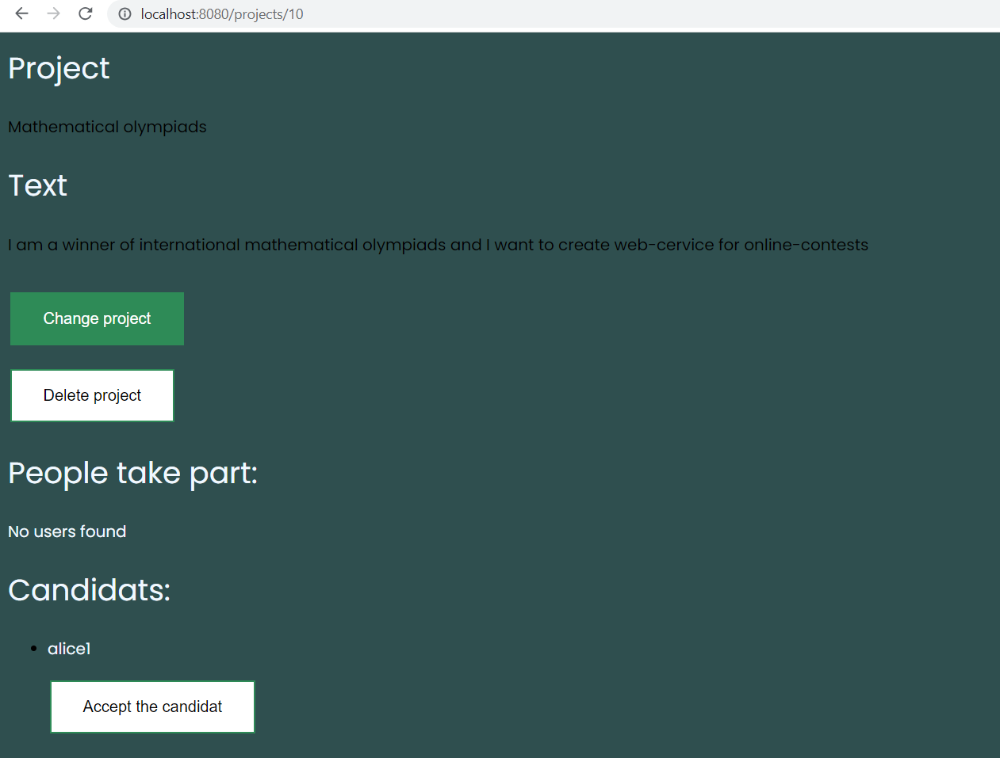

# TeamUp

Web application which allows users to create project ideas and form teams to take part in them.

### Technologies used in the project

* Spring Boot (Thymeleaf, Lombok)
* PostgreSQL

### Implemented features

* Registration and authorization
* Creating, changing, deleting project ideas
* Selecting candidates for project team
* Applying for projects of other users
* Viewing users and projects pages

 

 Registration page 

 

 Projects 

 

 Project created by current user 

 
